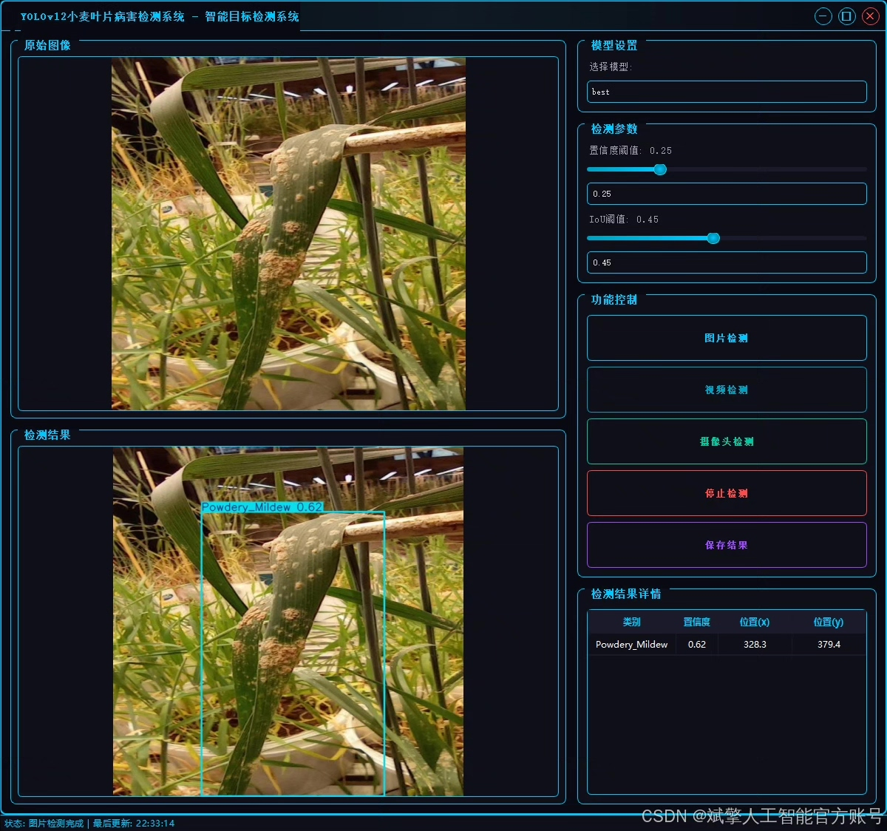
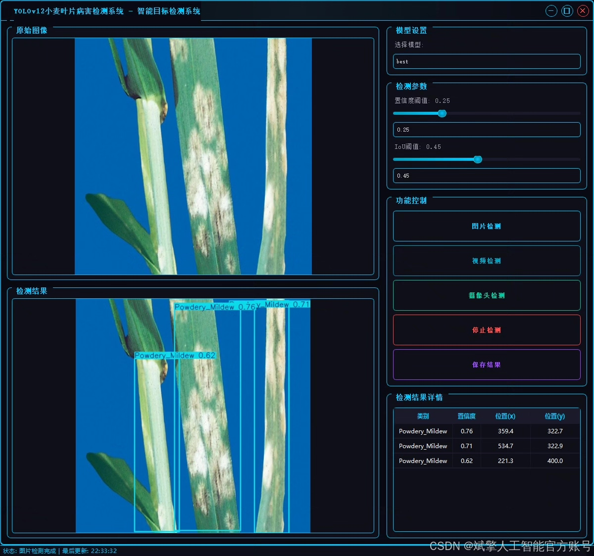
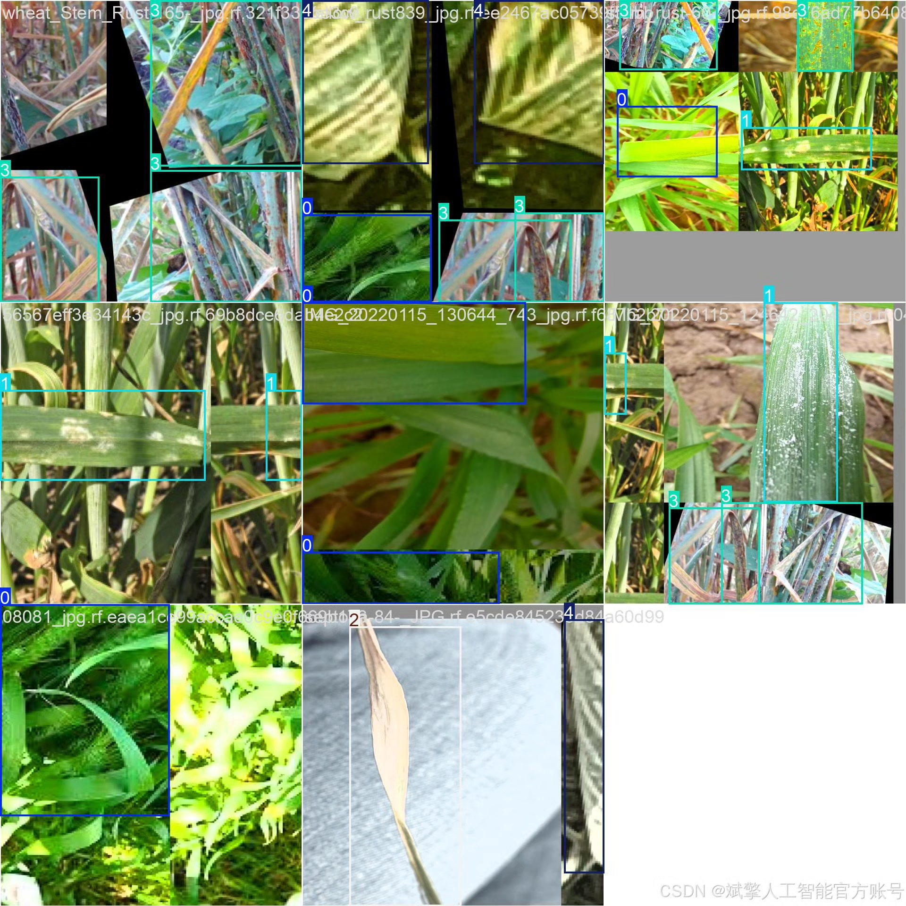
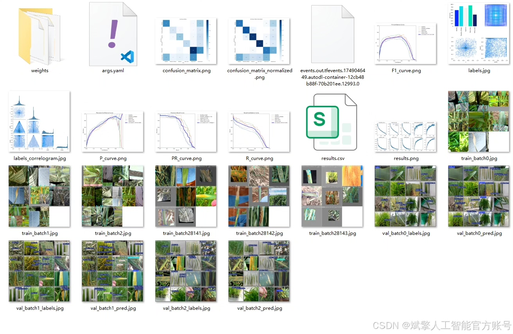
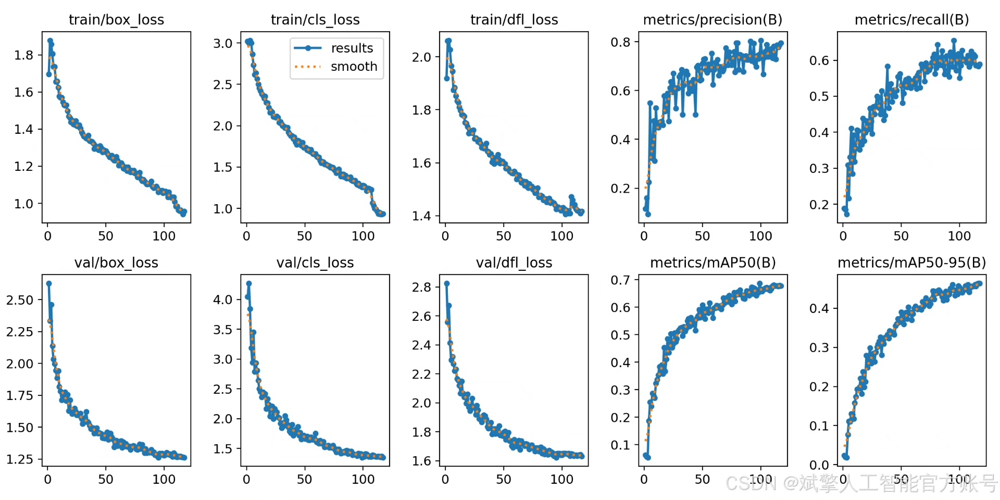
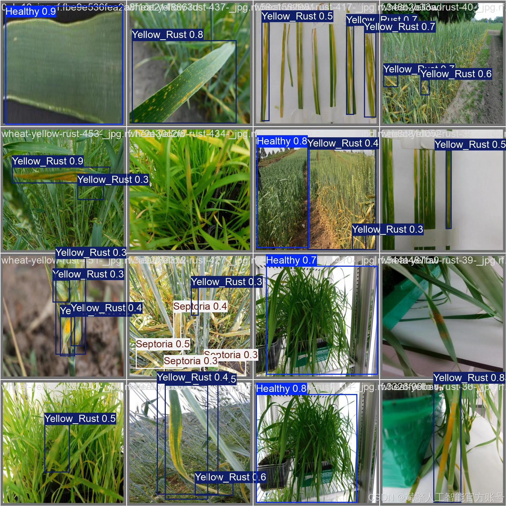

# YOLOv12 Wheat Disease Identification System

## Body

YOLOv12 Wheat Disease Identification System Based on Deep Learning YOLOv12: A Wheat Leaf Disease Identification and Detection System (YOLOv12+YOLO dataset + UI interface + login registration interface + Python project source code + model)

Wheat leaf diseases severely impact crop yield and quality, and rapid and accurate disease identification is crucial for agricultural production. This paper constructs an efficient wheat leaf disease intelligent detection system based on the YOLOv12 deep learning algorithm. The system can identify five types of diseases (healthy leaves, powdery mildew, septoria leaf blight, rust, yellow rust), using a dataset containing 2604 images (training set 2100, validation set 366, test set 138). The model is trained and evaluated using this dataset. By integrating a user-friendly UI interface and login registration functions, the system achieves automation and visualization of disease detection. Experimental results show that YOLOv12 achieves relatively high accuracy on the test set, providing reliable technical support for early diagnosis of wheat diseases.

✅ User Login Registration: Supports password verification and security validation.
✅ Three detection modes: Based on the YOLOv12 model, supports image, video, and real-time camera detection, accurately identifying targets.
✅ Dual-screen comparison: Displays the original scene and detection results simultaneously on the screen.
✅ Data visualization: Real-time table displays the category, confidence, and coordinates of detected targets.
✅ Intelligent parameter adjustment: Offers a confidence slide bar to dynamically optimize detection accuracy, adapting to different scene requirements.
✅ Sci-fi style interactive interface: Dark theme combined with dynamic light effects, reducing visual fatigue and enhancing operational experience.

## Images

## Payment

Here is a pay link on Stripe ( https://buy.stripe.com/3cs8yP7sY87d0vu9AB ). Please contact me lonlonago@foxmail.com after funding $89, and I will send you a complete data files , thank you!

